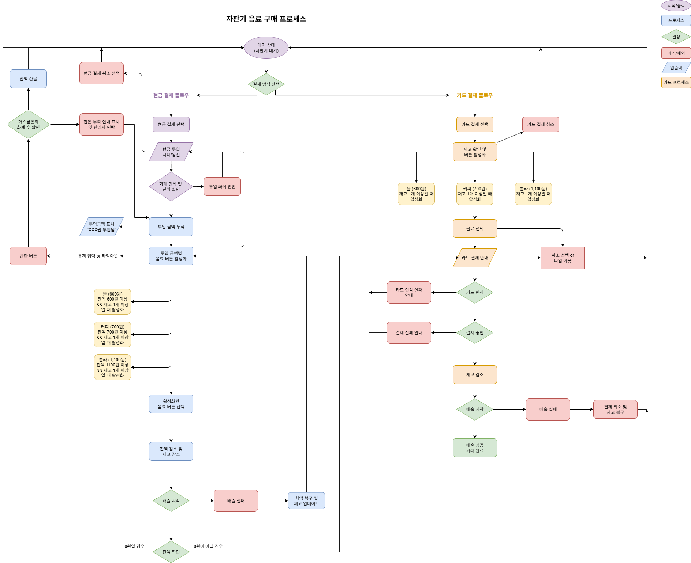

# 자판기 시뮬레이터

React + TypeScript로 구현한 자판기 시스템  

## 다이어그램

**자판기 동작 메커니즘 다이어그램**: [`docs/vending-machine-flow.drawio`](./docs/vending-machine-flow.drawio)



다이어그램 열람 방법:
- [draw.io](https://app.diagrams.net/)에서 파일 업로드
- VSCode Draw.io 확장 프로그램 설치 후 열람
- 웹 브라우저에서 draw.io → File → Open from → Device

**다이어그램 내용**: 현금/카드 결제 플로우, 예외 처리 분기, 상태 전환 다이어그램

## 기술 스택

- Frontend: React 19.1.1, TypeScript 5.8.3
- Build Tool: Vite 7.1.2 (SWC 플러그인)
- State Management: Zustand 5.0.8 (경량 상태 관리)
- UI Components: shadcn/ui + Radix UI
- Styling: Tailwind CSS 4.1.13
- Icons: Lucide React 0.542.0
- Code Quality: ESLint + TypeScript

## 빠른 시작

### 필수 요구사항
- Node.js 18+ 
- pnpm (권장 패키지 매니저)

### 설치 및 실행

저장소 클론:
```bash
git clone https://github.com/your-username/wise-vending-machine.git
cd wise-vending-machine
```

패키지 설치:
```bash
pnpm install
```

개발 서버 시작:
```bash
pnpm dev
```
http://localhost:5173 에서 확인

프로덕션 빌드:
```bash
pnpm build
```

빌드 결과 미리보기:
```bash
pnpm preview
```

코드 검사:
```bash
pnpm lint
```

타입 검사:
```bash
pnpm typecheck
```


## 사용 방법

### 기본 구매 방법

#### 현금 결제
1. 결제 방식 선택: "현금" 버튼 클릭
2. 현금 투입: 100원~10,000원 버튼으로 금액 투입
3. 음료 선택: 투입 금액 이상의 음료 버튼 활성화됨
4. 음료 배출: 선택한 음료가 배출구로 나옴
5. 거스름돈 수령: 잔돈이 있으면 자동 반환

#### 카드 결제  
1. 결제 방식 선택: "카드" 버튼 클릭
2. 음료 선택: 재고가 있는 음료 버튼 활성화됨
3. 카드 결제 확인: 결제 확인 대화상자에서 승인
4. 결제 완료: 승인 후 음료 자동 배출

